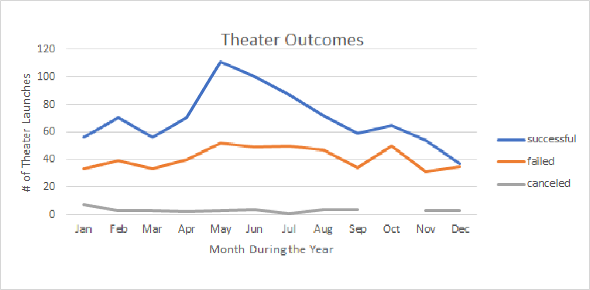
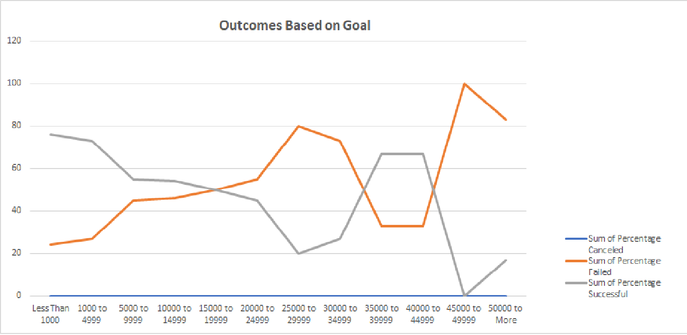

# Loise’s Kickstarter Analysis
## Overview
  To examine different campaign outcomes in relation to their launch dates and funding goals.

### Purpose
  To explore any connection with launch dates and their outcome and whether funding goals have any correlation with their outcome. 

## Analysis and Challenges
### Analysis of Outcomes Based on Launch Date
  I took all available data on theater launches in the Kickstarter Challenge dataset and filtered it to show the number of successful, failed and canceled launches based on the month launched. 

### Analysis of Outcomes Based on Goals
  I took all the data in the Kickstarter Challenge and filtered it to show the percentage of successful, failed and canceled Kickstarter campaigns for plays based on their goal amount. 

### Challenges and Difficulties Encountered

  One difficulty was extracting the data for months only, given multiple years on the theater outcomes.  I was able to do this in a pivot table, which took the date of the conversion and broke it down into years, quarters and months for me.   
  
## Results

**- What are two conclusions you can draw about the Outcomes based on Launch Date?**

First, the findings showed that May had the most number of launches during the year and was the most successful month for theater outcomes, with 111 successful, 52 failed and 3 canceled. 
Secondly, in every month, the number of successful theater launches was always more than the number of failed launches. 

**- What can you conclude about the Outcomes based on Goals?**

The findings showed that Kickstarter launches with goals under $1000 were the most successful at 76% out of a total 186 launches.  However, launches with a goal between $1,000 and $4,999 were a close 2nd, at 73% with 534 total launches in this range.

**- What are some limitations of this dataset?**

This data set only contains information from Kickstarter for fundraising.  While it is popular, it is not the only business that handles fundraising campaigns around the world, and may be missing out on large portions of information, that could upset the finding from this dataset. 
In addition, while collecting data on theaters and plays is a good start, I would like to see more specific data on campaigns for plays closely related to the one Louise if fundraising for, as plays is a generic term and not specific to the genre. 
I also found that in the theater outcome data, it contained date from 2010 – 2017, but not all years are noted for each month.  

**- What are some other possible tables and/or graphs that we could create?**

We could create a Box and Whiskers chart for the play launch outcomes, that would tell us where the true median was, and find the average by including the 1st and 3rd quartile, which would help rule out outliers. 

